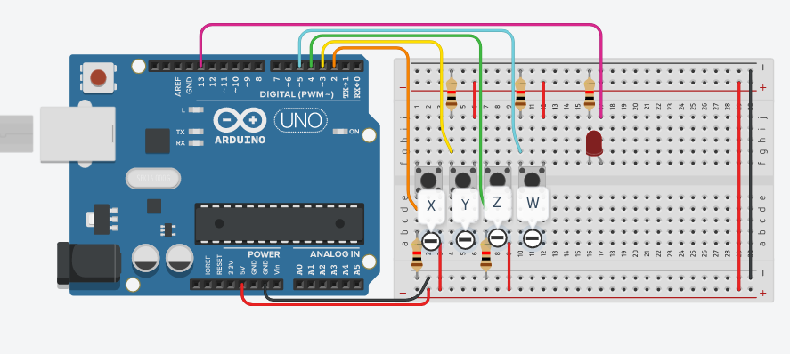

# Laboratorio 1
Este era muy simple, en términos de programación sólo se solicitaba crear compuertas lógicas
mediante Arduino, en este caso decidí usar macros de C `#define ...`, pero realmente con funciones
normales se tendría el mismo funcionamiento al final, más adelante el laboratorio solicitaba
verificar unas ecuaciones bien largas y tediosas, ahí están implementadas, no tienen nada de
especial.

Para cambiar el problema que se está corriendo, se descomenta y comenta lo que sea de interés en las
macros de arriba, el archivo explica esto mismo con más detalle en los comentarios iniciales.

## Bugs conocidos
* Ninguno de momento

## Circuito

    

