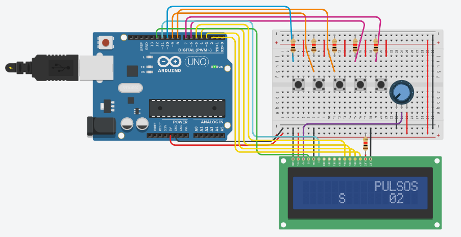

# Laboratorio 3
En resumen, este circuito genera la secuencia para conducir un motor stepper, imprime en un LCD los
valores en binario que se usarían para uno de dos polos (izq) así como uno de sólo un polo
(derecha), mientras que los botones permiten variar la cantidad de pulsos por segundo que calcula el
Arduino para variar la velocidad de rotación de los motores.

## Bugs conocidos
* Esta versión del código no era la final pero no recuerdo dónde puede estar la corregida, falta 
  corregir la secuencia del motor bipolar, esta no se calculaba correctamente en este código.
* El LCD no se aprecia correctamente pues se imprime todo el texto cada pulso, sería mejor sólo
  reimprimir los bits que controlan los motores.
* El input para variar los pulsos por segundo es muy sensible, se debe implementar un delay entre
  detectar el botón presionado y aumentar el número de pulsos por segundo, así la experiencia de uso
  será mejor.

## Circuito

    

