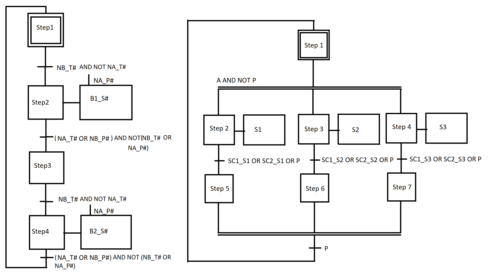

# Laboratorio 5
Este era con [TIA
Portal](https://new.siemens.com/global/en/products/automation/industry-software/automation-software/tia-portal.html)
y consistía básicamente en volver a implementar las benditas bombas alternadas, pero este se hacía
mediante GRAFCET y modulos reutilizables para cada subsistema de bombas.

## Bugs conocidos
* No es un bug, pero para que TIA Portal permita usar el archivo se debe configurar el modelo exacto
  de PLC que se tenga y la versión de firmware idéntica, si no coinciden con los usados en este
  archivo se tiene que modificar antes de poder compilar.

## Circuito
No tengo TIA instalado, pero tengo los GRAFCET que usé para diseñarlo, y me quedaron bonitos

    

