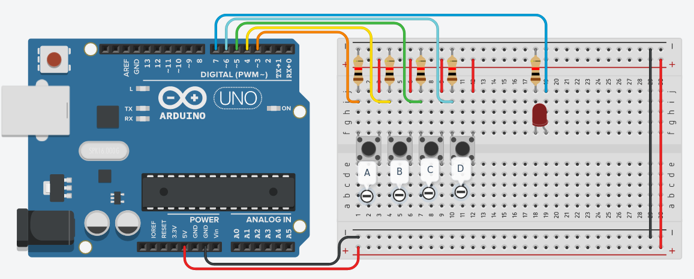

# Práctica 2
Esta práctica constaba de implementar multiplexores mediante funciones en Arduino que puedan ser 
reutilizadas en laboratorios futuros.

## Bugs conocidos
* No, manda

## Circuito

    

