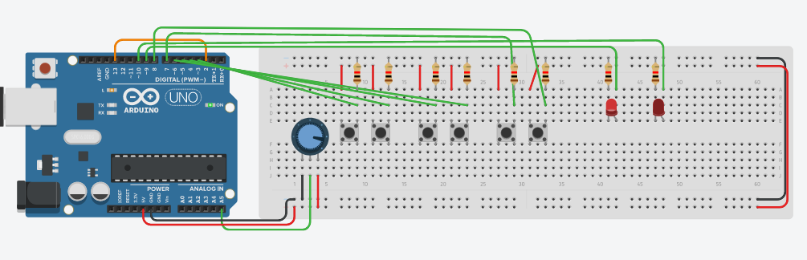
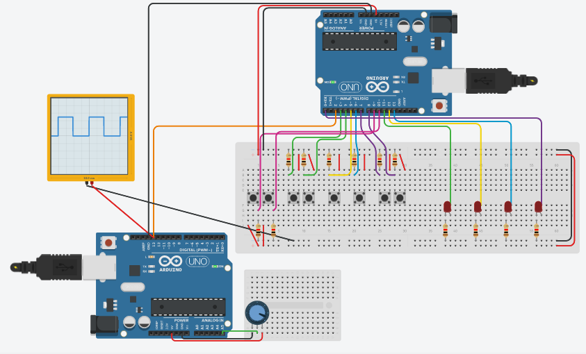

# Práctica 3
Visualizar distintas compuertas lógicas mediante el uso de LEDs, inicialmente se solicitó que usara
dos Arduinos, uno para generar un tren de pulsos rectangulares, mientras que el otro respondiera a
los flancos positivos del primero mediante un ISR, esto para las compuertas que no son biestables.

## Bugs conocidos
* El código de un sólo Arduino no está completo, sólo fue una prueba que se hizo antes de tener la
  versión final, esa no la he encontrado aún.

## Circuitos

    
    

