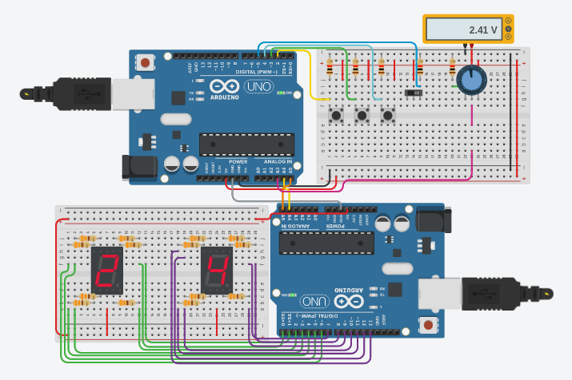

# Proyecto 1
Este problema consistía en crear un voltímetro mediante el uso de dos Arduinos comunicados mediante
el protocolo I2C (también conocido como IIC), el maestro se encargará de imprimir los datos que
recibe en dos LCD de 7 segmentos, mientras que el esclavo se dedica a tomar las mediciones y
responder al maestro.

## Bugs conocidos
* Creo que en esta versión el redondeo del decimal está mal implementado, pero no es nada que no se
  resuelva con unos cambios en la línea de código que redondea.

## Circuito

    

